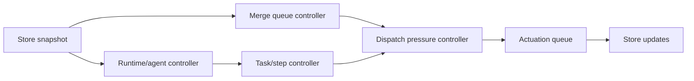

# PID-Like Control Plane Design

## Status

Partially implemented design for evolving Clankwork's deterministic control plane
from a threshold-based supervisor into a richer reconcile controller for chaotic
agent runtimes. The current implementation has explicit control-state summaries,
progress evidence buckets, failure-signature based oscillation detection, durable
decisions and actuations, and graduated merge-queue pressure. Semantic correctness
still comes from deterministic verification and acceptance evidence.

## Why This Exists

Clankwork already has deterministic loops for dispatch, reconciliation, and merge processing. What it does not yet have is a first-class model of:

- the desired state of a task, step, or runtime
- the observed state of that task, step, or runtime
- the error between those two states
- a graded actuation policy that responds proportionally instead of mostly using timeout edges

Today the control plane behaves more like a watchdog:

- dispatch fills available slots
- reconcile decides whether an agent looks healthy or stalled
- stalled agents are nudged once, then killed or routed to failure

That is deterministic and pragmatic, but it is still mostly binary control. The goal of this design is to preserve deterministic control-plane behavior while making it better at steering non-deterministic agents back toward target state.

## Design Goals

- Keep the control plane deterministic. No LLM calls in daemon code.
- Model control as continuous reconciliation toward target state, not only timeout-triggered intervention.
- Use richer ACP observability without making tmux unsupported.
- Prefer lower-cost corrective actions before high-cost restarts or reroutes.
- Detect and damp oscillation instead of repeating the same recovery forever.
- Make controller state inspectable through the store, traces, and CLI.

## Non-Goals

- Replacing workflow templates with a learned planner
- Requiring ACP for all runtimes
- Hiding all agent chaos behind a fake notion of certainty
- Building a mathematically pure PID implementation with floating-point tuning constants before there is enough operational data

This is a PID-inspired control architecture, not an attempt to turn Clankwork into an industrial control-systems simulator.

The implementation should still look like deterministic discrete control: explicit state, transition guards, policy decisions, and traced reasons. PID is the vocabulary for how the policy should behave over time:

- proportional: respond to the current mismatch with the cheapest plausible correction
- integral: accumulate unresolved error and escalate when cheap corrections do not resolve it
- derivative: detect instability and avoid repeating a recovery strategy that is already oscillating

It should not lead the code toward floating-point gains, continuous control math, or a belief that agent failure modes are linear. Most agent failures are categorical, so the controller should be implemented as a history-aware state machine with policy tables, not as a numeric PID loop.

## Current State

The control plane already has the foundation of a reconcile loop:

- The daemon runs periodic loops for dispatch, reconcile, merge queue, synthesis, and GC.
- The dispatcher computes runnable work from the DAG and available slots.
- The reconciler checks runtime liveness, heartbeat freshness, pane activity, ACP event freshness, and a few stop conditions.
- Template routing advances tasks deterministically and idempotently between steps.
- ACP events are persisted, which gives the system a richer event stream than tmux pane scraping alone.

The current implementation now has an explicit controller vocabulary and durable
decision/actuation records, but remains intentionally conservative. It still
answers these narrow questions first:

- Is the runtime alive?
- Is the heartbeat stale?
- Did ACP emit a recent event?
- Did the turn end without a signal?
- Did we already send one nudge?

That is enough for supervision. Progress evidence, failure signatures, and
pressure levels add the first control-oriented layer without making the daemon
semantic.

## Core Model

The PID-like controller should operate on four explicit concepts.

### 1. Desired State

Desired state is what the control plane believes should be true right now for a task.

For a template-driven task, desired state includes:

- task should be at step `S`
- task should have exactly one active execution owner for that step
- that owner should be using runtime class `R`
- the step should emit progress evidence within expected bounds
- the step should be converging toward its exit condition within retry budget

For deterministic steps, desired state may be simpler:

- process should be running or completed
- expected verification command should have produced an exit status by deadline

For merge queue work, desired state includes:

- item should be queued, rebasing, verifying, merging, merged, or rejected
- backpressure should adapt to queue depth and failure rate, not only a static threshold

### 2. Observed State

Observed state is the control plane's best deterministic snapshot of reality.

Sources include:

- task rows
- agent rows
- ACP event stream
- runtime liveness
- pane activity for tmux
- signal traces
- worktree facts
- deterministic verification results
- merge queue state

Observed state should be summarized, not recomputed from raw history on every tick.

### 3. Error Vector

Instead of a single boolean like "stalled", the controller should compute a structured error vector.

Suggested dimensions:

- `liveness_error`: runtime missing, heartbeat missing, ACP session silent
- `progress_error`: no useful evidence of advancing the step
- `verification_error`: deterministic checks failing or regressing
- `coordination_error`: waiting on permissions, blocked on missing input, merge pressure
- `stability_error`: repeated oscillation across the same states or recovery actions

Each dimension can start as coarse, bounded integers rather than real-valued tuned gains.

### 4. Actuation Policy

The controller should map error state to a graded sequence of deterministic interventions.

Suggested actuations, in increasing cost:

- no-op
- append observation only
- send progress nudge
- send explicit lifecycle nudge
- request structured status from agent
- run a cheap deterministic check
- cancel current ACP turn
- gracefully restart the runtime
- reroute the task through failure edge
- escalate runtime tier
- mark blocked for human input

The key design point is that the controller chooses among these based on error severity and history, not only elapsed time.

## PID Mapping

This design uses PID as a control metaphor and policy shape.

### Proportional Term

The proportional term responds to current divergence.

Examples:

- ACP turn ended without `signal done`
- heartbeat is stale but runtime is still alive
- merge queue depth is above target
- an agent is waiting on a permission request

The controller should respond quickly with the cheapest plausible correction.

### Integral Term

The integral term captures accumulated unresolved error.

Examples:

- the same task keeps hitting the same verify failure
- the same step keeps stalling after a nudge
- ACP turns repeatedly end without lifecycle signals
- the merge queue stays backed up for many ticks

Integral state is what should drive escalation. A single failure may justify a nudge. Persistent unresolved error should justify a stronger intervention.

### Derivative Term

The derivative term dampens oscillation and overreaction.

Examples:

- implement/test/implement/test loops with no new signal
- repeated ACP restart cycles
- repeated nudge-then-fail patterns
- queue pressure rising sharply even if absolute depth is still below hard pause threshold

Derivative behavior should bias the controller away from applying the same fix harder when the system is already oscillating.

## Task Controller

The most important controller boundary is per task.

Each task should have a materialized control-state record derived from raw store state. Conceptually:

```text
TaskControlState
- task_id
- desired_step
- desired_runtime_class
- desired_execution_mode
- observed_step
- observed_runtime_health
- observed_progress_state
- observed_verification_state
- error_vector
- last_actuation
- escalation_level
- oscillation_score
- updated_at
```

This does not need to be exposed exactly as a Go struct first. It can begin as an internal summary object computed in reconcile and later persisted.

### Useful Progress

The controller must distinguish "activity" from "useful progress".

Examples of activity:

- ACP events are arriving
- pane output changed
- `signal progress` was emitted

Examples of useful progress:

- agent emitted a lifecycle transition
- deterministic verification moved from failing to passing
- worktree changed in a way that corresponds to the current step
- ACP showed concrete tool execution rather than idle turn churn

The current system mostly measures activity. PID-like control requires measuring useful progress.

Useful progress is the hardest part of the design, so the initial version should stay deliberately conservative. The controller should not try to infer semantic correctness. It only needs to answer a narrower question:

- is the task converging toward a step exit condition

Suggested first-pass heuristics by step type:

- agent implementation step:
  - positive signals: lifecycle signal emitted, deterministic failures changed materially, worktree changed after prior failure context, ACP shows tool execution touching relevant files
  - weak signals: free-form `signal progress`, generic conversational output, ACP chatter without file/tool activity
  - negative signals: repeated turn completion without lifecycle signal, identical failure signature across retries, no worktree delta across multiple controller intervals
- deterministic verification step:
  - positive signals: command exited, failing checks became passing, number of failing suites decreased
  - negative signals: timeout, identical failure output repeated, no command completion by deadline
- acceptance step:
  - positive signals: acceptance evidence produced, reproducible failing behavior narrowed, tool activity corresponds to exercising the software
  - negative signals: repeated conversational summaries without concrete evidence, repeated environment/setup churn with no observed test execution

These are still proxies. A task can produce worktree changes, tool activity, and changed verification output while making no semantic progress. The controller should therefore treat useful-progress classification as evidence, not proof.

The initial implementation classifies progress into three buckets only:

- `progress_unknown`
- `progress_present`
- `progress_absent`

That keeps the first controller simple enough to ship while still separating
"alive" from "converging." ACP decisions persist the bucket in
`agent_controller.decision` payloads and task diagnosis exposes it in
`control_state`.

The first useful-progress model should be named honestly in code and docs: it is a conservative progress-evidence estimator, not semantic correctness detection. Semantic convergence should come from deterministic verification, acceptance evidence, and failure-signature history.

### Worked Example: Useful Progress vs Activity

Consider an `implement` step running over ACP:

1. The agent emits many ACP updates and ends the turn.
2. There is no `signal done`, no `signal failed`, and no `signal blocked`.
3. The worktree has not changed since the prior controller snapshot.
4. The previous deterministic test failure signature is unchanged.

This is activity, but not useful progress. The controller should increase `progress_error` and `stability_error`, not clear them just because the transport was busy.

Now consider a second case:

1. ACP emits tool execution events touching source files and tests.
2. The worktree changed after the last failure context was injected.
3. The agent emits `signal progress` with a step-specific update.
4. The next deterministic verification result changes materially, even if it still fails.

This is useful progress. The controller may keep the task running even if it is not yet correct.

### Agent-to-Controller Contract

The highest-leverage observability improvement is not smarter inference. It is better cooperation from agents.

The current control plane infers most state from noisy external signals: ACP updates, pane activity, worktree changes, and lifecycle signals. That is useful, but it is weaker than an explicit agent contract. A later phase should introduce structured progress/checkpoint signals such as:

```text
clankwork signal checkpoint \
  --milestone "wrote regression test for X" \
  --evidence "changed internal/foo_test.go; failing assertion moved from auth to validation"
```

or extend `signal progress` with structured fields:

- step milestone
- files intentionally changed
- verification attempted
- current blocker, if any
- confidence or remaining work estimate

The controller should not blindly trust these claims, but they give it a cleaner observation channel than raw activity. Controller quality is bounded by observation quality, and observation quality is bounded by what agents tell the control plane.

## ACP-Specific Design

ACP is the most important observability upgrade for this design.

Today ACP events are persisted, but the reconciler reduces them to a few booleans. The new design should classify ACP activity more explicitly.

Suggested derived ACP states:

- turn active
- turn ended waiting for lifecycle signal
- permission pending
- tool execution active
- idle or silent
- context limit reached
- runtime exited
- repeated turn completion without task completion

This is the path to a controller that can distinguish:

- "agent is busy doing work"
- "agent is blocked waiting for permission"
- "agent is conversationally done but forgot to signal"
- "agent is looping"

That distinction is the difference between supervision and control.

## tmux Compatibility

tmux remains a supported transport. The PID-like model should degrade gracefully.

tmux-derived observed state can include:

- process alive
- pane recently active
- context-limit text patterns
- signal history

tmux cannot provide the same precision as ACP, so the controller should use wider thresholds and fewer fine-grained actuation options there.

The controller should not fork into two separate architectures for ACP and tmux. It should use the same control model with different observation quality.

Conceptually:

- ACP provides high-resolution observations
- tmux provides low-resolution observations
- the controller consumes whichever observation fields are available
- unsupported fields remain `unknown` rather than forcing separate logic trees

That keeps the policy surface unified while still allowing ACP-specific actuation where appropriate.

## Merge Queue as a Controller

The merge queue is also a control loop and should be treated as one.

Today queue pressure is effectively boolean: above threshold pauses dispatch. That is useful but crude.

A PID-like merge controller should consider:

- current queue depth versus target depth
- age of oldest queued item
- verification failure rate
- conflict rate
- target branch churn

Suggested actuations:

- reduce new dispatch aggressiveness
- prefer smaller or lower-risk tasks
- delay auto-merge enqueue for noisy repos
- increase verification strictness before merge
- surface a repo-local hotspot signal for human attention

This should still remain deterministic and policy-based.

### Controller Coupling and Tick Order

Task, runtime, dispatch, and merge queue controllers consume overlapping state. Their coupling must be explicitly acyclic within a single tick, or Clankwork can create control-plane oscillation:



Rules:

- Each controller reads from a stable snapshot for the current tick.
- Controller outputs may feed later controllers in the same tick only in one direction.
- Store writes from actuations become inputs to the next tick, not back-edges into earlier controllers in the same tick.
- If two controllers need each other's outputs, one dependency must be delayed to the next tick.

This preserves deterministic behavior and prevents tight feedback loops such as dispatch relaxing immediately after merge pressure drains, then refilling the queue in the same control pass.

## Anti-Oscillation Policy

The control plane should explicitly detect and damp repeated loops.

Examples of oscillation worth detecting:

- `implement -> test -> implement` repeated with the same failing log signature
- ACP runtime restarted multiple times for the same task
- repeated nudge timeout on the same step
- merge requeue after verify failure repeating with the same error

When oscillation is detected, the next actuation should be categorically different.

Examples:

- escalate runtime
- switch role or template edge
- inject failure context more aggressively
- mark blocked instead of retrying again
- request human input

### Failure Signature Canonicalization

Oscillation detection depends on reliable failure signatures. Raw log hashes are too brittle: timestamps, temp paths, line numbers, pointer addresses, and unrelated ordering changes will create false novelty.

The controller needs a named failure-signature subsystem before serious oscillation policy ships.

First-pass canonicalization should prefer structured fields when available:

- test package or suite
- test file
- test name
- assertion kind or failure class
- command or deterministic step name
- normalized exit code

When only raw logs are available, normalization should remove volatile data before hashing:

- absolute temp paths
- timestamps
- durations
- random IDs
- memory addresses
- line numbers when the surrounding test/function identity is stable

The output should be something like:

```text
FailureSignature
- source: deterministic_test | acceptance | agent_failure
- step
- command
- class
- stable_fields
- normalized_hash
```

Phase 4 should treat repeated normalized signatures as oscillation even if weaker progress proxies changed. This guards against "activity with extra steps": a file changed, a tool ran, and the raw error text shifted, but the same underlying failure cluster remained.

## Persistence and Introspection

The controller should leave behind enough state that humans and future controller passes can inspect what happened.

The system should persist or derive:

- latest control-state summary
- last actuation and why it was chosen
- escalation level
- oscillation indicators
- error-vector summary

This can begin with traces and move into dedicated store tables if needed.

Recommended approach:

- start with in-memory controller summaries plus persisted decision traces
- persist every non-trivial actuation decision and its reason
- add dedicated controller-state tables only after the hot-path shape is stable

This gives the system operator visibility into why decisions were made without immediately committing to a high-write persistent model on every reconcile tick.

A useful rule of thumb:

- observations may remain ephemeral
- decisions should be durable

That is enough to debug the controller while preserving flexibility in early iterations.

The CLI should eventually expose:

- task control summary
- why a task was nudged, restarted, escalated, or blocked
- current queue pressure state
- current controller-derived health for each agent

### Human Escalation Path

Marking a task blocked is only useful if the block is visible to a human operator.

The controller should treat "blocked for human input" as an operator-facing event with at least three outputs:

- task status becomes `blocked`
- a structured trace explains the controller's reason, evidence, and attempted prior actuations
- CLI surfaces blocked tasks prominently in status and task detail views

The first implementation does not need push notifications or paging. It does need clear local visibility so a human running Clankwork can answer:

- what got blocked
- why it got blocked
- what the controller already tried
- what input is needed to unblock it

For unattended home-rig operation, local CLI visibility is not enough before the controller is considered production-ready. A blocked-for-human-input actuation should also capture attention through at least one local notification channel:

- terminal bell/log highlight when attached
- macOS notification when available
- prominent `status` summary that lists blocked tasks first

Silently blocked work is an end-to-end failure even if the controller made the correct local decision.

## Proposed Architecture Changes

### Add a Controller Layer

Introduce a dedicated controller or estimator layer between raw observations and actuation.

Suggested conceptual flow:

1. Observe raw runtime, task, queue, and event state
2. Build summarized observed state
3. Compare to desired state
4. Compute error vector and stability indicators
5. Decide actuation
6. Record the decision
7. Apply the actuation

This can live initially inside `internal/scheduler/reconciler.go`, but the logic should be structured so it can grow into its own module cleanly.

### Materialize Control State

Avoid repeatedly scanning large event histories inside hot loops.

Instead:

- maintain rolling summaries as events arrive
- or persist controller snapshots
- or both

ACP event ingestion is a natural place to update per-agent observed-state summaries.

### Split Health from Progress

An agent can be healthy but not progressing.

That distinction should become first-class. Health answers whether the runtime is alive and reachable. Progress answers whether the current task is converging.

### Make Backpressure Continuous

Replace binary queue pressure with graduated dispatch pressure.

Examples:

- normal mode
- reduced dispatch mode
- drain mode
- hard pause

### Standardize Recovery Policies

Recovery actions should be selected through policy tables or explicit decision code, not scattered ad hoc branches.

That will make it easier to test and easier to explain why the controller acted the way it did.

### Trace Replay Testing

Controller tests should include trace replay as a first-class validation mode.

Unit tests for pure decision functions answer the easy question: given a state vector, did the controller choose the expected actuation? Trace replay answers the harder question: did real runtime events produce the correct state vector?

Clankwork already persists ACP and trace events. A replay harness should be able to:

1. Load a captured event sequence from a fixture.
2. Rebuild observed controller state without running a real agent.
3. Assert derived state such as `turn_ended_without_signal`, `context_limit`, `permission_pending`, or `progress_absent`.
4. Assert the decision and actuation the controller would choose.

The replay corpus should include labeled examples:

- real stall
- false-positive stall avoided
- context limit
- ACP no-signal turn
- permission blocked
- repeated failure signature
- acceptance failure with useful evidence

This corpus becomes the regression suite for controller inference. It is especially important because most future controller bugs will come from observation construction, not from pure policy logic.

## Implementation Plan

This plan intentionally starts with low-risk refactors and new visibility before changing actuation behavior aggressively.

The rollout should also acknowledge a bootstrap constraint: some controller features require earlier controller scaffolding before they can be implemented or evaluated well. The early phases should therefore focus on shape, instrumentation, and behavior parity before higher-order policy.

### Phase 1: Make Control State Explicit

- Add a controller-oriented design vocabulary to the code and docs.
- Introduce internal summary types for desired state, observed state, error vector, and actuation decision.
- Refactor reconciler code into explicit stages: observe, estimate, decide, act.
- Preserve current behavior where possible while moving to the new shape.

Deliverable:

- controller-shaped reconciler with behavior parity

Why first:

- this creates the structure needed for later progress and oscillation policies without changing outcomes yet

### Phase 2: Improve Observability

- Add summarized ACP-derived state instead of scanning full event logs every tick.
- Classify ACP events into progress-relevant categories.
- Record structured reasons for nudges, restarts, reroutes, and failures.
- Add traces for controller decisions and actuation outcomes.

Deliverable:

- inspectable controller decisions for ACP and tmux tasks

Why second:

- useful-progress and oscillation logic are not credible until observations and decisions are already visible

### Phase 3: Separate Health from Progress

- Introduce useful-progress heuristics distinct from liveness. **Implemented with coarse progress buckets.**
- Use signal history, verification results, ACP tool activity, and task-step context to infer convergence. **Partially implemented: ACP tool activity and no-signal turns feed progress evidence; repeated step failures feed oscillation detection.**
- Add explicit stuck-without-progress handling. **Implemented as nudge/block decisions for no-progress and oscillation cases.**
- Treat progress as evidence classification, not proof of semantic correctness.
- Begin designing the richer agent checkpoint/progress contract, but do not make core policy depend on it yet.

Deliverable:

- controller no longer treats "recent output" as sufficient evidence of convergence

Bootstrap note:

- this phase should begin with coarse progress buckets, not ambitious semantic inference

### Phase 4: Add Integral and Derivative Policies

- Track repeated failure signatures and stalled-step history. **Implemented for repeated step failure context and repeated ACP error turns.**
- Track restart counts, no-signal turn counts, and route oscillation.
- Escalate actuation based on accumulated unresolved error.
- Change strategy when oscillation is detected. **Implemented: repeated identical failure signatures block the task with controller evidence.**
- Add failure-signature canonicalization before using repeated failures for policy. **Implemented in the model controller primitives.**
- Add trace replay fixtures for at least one real oscillation and one false-positive case.

Deliverable:

- retry behavior becomes history-aware rather than tick-local

Bootstrap note:

- oscillation detection depends on controller history and decision traces from earlier phases; it should not be attempted before those exist

### Phase 5: Make Merge Pressure Graduated

- Replace boolean queue pressure with multi-level dispatch pressure. **Implemented with none/reduced/drain/hard levels.**
- Incorporate queue age, failure rate, and repo-local contention. **Implemented with depth, oldest age, recent failures, and conflict count.**
- Expose controller state in status surfaces. **Implemented in API/CLI status and task diagnosis.**
- Define controller tick order and coupling rules so task and merge controllers do not feed back into each other within the same tick.

Deliverable:

- dispatch rate becomes adaptive under load

### Phase 6: Dogfood Through Clankwork

Use Clankwork itself to implement the controller incrementally.

Suggested task decomposition:

- controller vocabulary and summary types
- reconciler refactor into explicit phases
- ACP state summarization
- trace replay harness and initial corpus
- useful-progress detection
- structured agent progress/checkpoint signal
- failure-signature canonicalization
- oscillation detection
- adaptive backpressure
- CLI/status visibility
- blocked-task attention capture
- docs and operational tuning notes

This dogfooding phase is expected to reveal:

- missing trace fields
- missing store primitives
- missing CLI visibility
- missing operator attention surfaces
- weak spots in template routing
- agent contract gaps around structured progress signaling

Those discoveries are part of the design, not exceptions to it.

Recommended dogfooding sequence:

1. Use Clankwork to refactor the reconciler into explicit controller phases with behavior parity.
2. Use Clankwork again to add controller decision tracing and CLI visibility.
3. Only then use Clankwork to add useful-progress heuristics and oscillation handling.

That sequence avoids asking the system to implement its own higher-order control logic before the lower-order scaffolding exists.

## Risks

- Overfitting to ACP and weakening tmux support
- Adding controller complexity without enough visibility to debug it
- Conflating progress inference with correctness
- Treating weak progress proxies as semantic convergence
- Building oscillation policy on brittle raw log hashes
- Creating feedback loops between task, dispatch, and merge controllers
- Letting blocked tasks disappear unless a human is actively watching the CLI
- Premature tuning before enough real runs exist
- Turning recovery policy into a maze of heuristics
- Building a controller whose extra complexity does not outperform simpler threshold-based supervision on ordinary happy-path workloads

The mitigation is to stage the rollout, preserve deterministic explainability, and instrument every controller decision.

### When Threshold-Based Control Is Still Fine

Threshold-based supervision remains sufficient when all of the following are true:

- task steps are short-lived
- runtimes are homogeneous
- failures are mostly crash-or-timeout failures
- queue pressure is low and stable
- retries rarely oscillate

In that environment, a binary watchdog is cheaper and easier to reason about.

The PID-like design pays for itself when:

- agent runtimes are heterogeneous
- ACP yields richer telemetry that can reduce false positives
- retries and handoffs become a meaningful fraction of system work
- merge pressure and task churn create feedback between subsystems
- the same classes of stall or oscillation recur often enough to justify policy

This design should therefore be implemented incrementally and justified with operational evidence, not treated as architecture for architecture's sake.

## Open Questions

- Should controller summaries live only in memory first, or be persisted immediately?
- Should structured progress become a new agent signal or remain inferred?
- What is the minimal structured checkpoint/progress contract agents can reliably emit?
- Should escalation policy live in config, templates, or controller code?
- How much controller state should be exposed in `clankwork status` versus task/agent detail views?
- Which local attention mechanisms should fire when the controller blocks work for human input?
- Should merge queue pressure be global, per repo, or both?
- What default bounded values should be used for escalation levels, retry signatures, and oscillation thresholds in the first rollout?
- What canonical failure-signature fields are available for each verification source?

## Tuning Strategy

The controller does not avoid tuning by using bounded integers. It only moves tuning into policy tables and thresholds that humans can reason about.

Recommended initial approach:

- start with small integer bands such as `0..3` for each error dimension
- set thresholds conservatively and bias toward visibility over intervention
- record every actuation with the threshold that triggered it
- review traces from real runs before changing defaults

The first tuning loop should be manual:

- collect controller decision traces
- group by repeated failure modes
- tighten or relax thresholds based on false positives and false negatives
- only externalize settings into config after the policy stabilizes

Clankwork should earn tunability by first proving that the controller decisions are explainable.

## Recommended Next Step

The next implementation step should be a small refactor that preserves behavior while introducing the controller vocabulary and decision boundaries. That creates a stable scaffold for the later policy changes and makes the system easier to dogfood against itself.

## Sequenced Work Plan

This section turns the phased rollout into concrete implementation steps that Clankwork can execute itself. For each step, the work definition is paired with an agent validation strategy so the agent can constrain the space of plausible solutions instead of only claiming completion.

### Step 1: Introduce Controller Vocabulary and Decision Shape

What needs to get done:

- Add internal types for desired state, observed state, error vector, and actuation decision.
- Refactor the reconciler into explicit stages such as observe, estimate, decide, and act.
- Preserve existing behavior as closely as possible while changing code shape.
- Add unit tests proving behavior parity for the current stall, nudge, and failure paths.

How an agent can validate the work:

- Run the existing scheduler and reconciler unit tests.
- Add or update tests that assert the same outcomes still happen for current cases:
  - stalled tmux agent gets nudged first
  - context-limit conditions still short-circuit to handoff
  - ACP turn-ended-without-signal still triggers the current nudge path
- Diff old and new trace-producing behavior in tests where possible so the refactor cannot silently delete existing signals.

### Step 2: Record Controller Decisions Explicitly

What needs to get done:

- Add structured trace events for controller decisions and actuations.
- Capture at least:
  - controller reason
  - chosen actuation
  - key evidence fields
  - whether the action was proportional, integral-driven, or stability-driven
- Ensure tmux and ACP paths both emit controller decision traces.

How an agent can validate the work:

- Add tests that exercise controller paths and assert trace rows were appended with expected event types and payload fields.
- Run task or agent API tests if they touch trace rendering.
- Verify that decision traces appear for both a tmux stall case and an ACP no-signal case.

### Step 3: Add Lightweight Observed-State Summaries

What needs to get done:

- Stop relying on full raw ACP event scans inside the hot reconcile path.
- Introduce lightweight summaries for recent ACP-observed state.
- Keep the design simple: summarize event freshness, turn state, permission-pending state, and tool-activity presence before attempting deeper semantics.
- Preserve tmux support with equivalent low-resolution observations.

How an agent can validate the work:

- Add tests showing the reconciler can make the same decisions using summarized state.
- Add targeted tests for ACP summary updates when events indicate:
  - turn started
  - turn completed
  - permission pending
  - context limit
- Compare reconcile behavior before and after the summary layer for known cases.

### Step 4: Separate Health from Progress

What needs to get done:

- Introduce a first coarse progress model with `progress_unknown`, `progress_present`, and `progress_absent`.
- Use step-aware heuristics rather than generic activity heuristics.
- Teach the controller that recent output alone does not imply convergence.
- Keep the initial heuristics conservative and inspectable.
- Make clear in names and traces that this is progress evidence, not semantic correctness.
- Sketch or stub the structured agent checkpoint/progress signal shape.

How an agent can validate the work:

- Add tests for concrete cases where:
  - activity exists but useful progress should be treated as absent
  - worktree changes plus changed verification output count as progress present
  - missing evidence stays progress unknown rather than forcing a false classification
- Run the relevant scheduler, worker, and API tests to ensure no existing signal semantics were broken.
- Add a negative test showing weak activity signals do not force `progress_present`.

### Step 5: Add Oscillation and Retry-Signature Detection

What needs to get done:

- Add a failure-signature canonicalization subsystem with tests.
- Detect repeated loops such as:
  - implement/test/implement with unchanged failure signatures
  - repeated ACP restart cycles
  - repeated nudge timeout on the same step
- Track these as controller history rather than ad hoc local variables.
- Increase `stability_error` when loops repeat without material progress.

How an agent can validate the work:

- Add tests that simulate repeated failure cycles and assert oscillation is detected after the configured threshold.
- Verify that repeated identical failures are treated differently from failures that materially change over retries.
- Verify normalization removes volatile fields without collapsing genuinely different failures.
- Ensure the controller does not over-classify oscillation on a single retry.

### Step 6: Add Graded Escalation Policy

What needs to get done:

- Map accumulated error and oscillation state to different corrective actions.
- Ensure repeated unresolved error changes the next actuation category instead of only repeating the same recovery.
- Start with a small policy table that is easy to explain and test.
- Keep blocked-for-human-input as an explicit, traceable actuation.

How an agent can validate the work:

- Add table-driven tests for controller decisions:
  - first occurrence produces a low-cost action
  - repeated occurrences escalate
  - oscillation causes a categorically different response
  - high-confidence dead runtime still fails fast
- Verify blocked tasks expose clear controller reasoning in traces.

### Step 7: Expose Controller State in the CLI

What needs to get done:

- Surface controller-derived health, last actuation, and blocked reasons in CLI views.
- Prioritize human-operable visibility over exhaustiveness.
- Make blocked tasks and repeated controller interventions obvious in `status`, task detail, or agent detail views.
- Add local attention capture for blocked-for-human-input transitions.

How an agent can validate the work:

- Add CLI rendering tests where available.
- Add API tests if new server surfaces are introduced.
- Verify that a blocked task shows:
  - what happened
  - why it was blocked
  - what the controller already tried
- Verify a blocked transition emits an operator-facing notification or terminal attention signal where supported.

### Step 8: Make Merge Pressure Graduated

What needs to get done:

- Replace boolean dispatch backpressure with a small set of pressure levels.
- Base those levels on depth, age, and failure pressure rather than depth alone.
- Keep the first version simple enough to reason about in tests.
- Document and test the controller tick order so merge pressure changes affect dispatch deterministically without same-tick feedback loops.

How an agent can validate the work:

- Add merge queue and scheduler tests proving:
  - low pressure does not pause dispatch
  - elevated pressure reduces aggressiveness
  - severe pressure still pauses dispatch when needed
- Verify the scheduler remains deterministic under the new pressure policy.

### Step 8.5: Add Trace Replay Harness

What needs to get done:

- Add fixtures for captured ACP/trace event sequences.
- Build a replay harness that derives observed controller state from those events.
- Assert derived state and chosen decisions for known real cases.
- Keep fixtures small and labeled by failure mode.

How an agent can validate the work:

- Add replay tests for at least:
  - context limit
  - ACP no-signal turn
  - false-positive streamed context-limit text
  - real stall
- Run scheduler and model tests plus `go test ./...`.

### Step 9: Dogfood the Controller on Itself

What needs to get done:

- Use Clankwork tasks and templates to implement the preceding steps in sequence.
- Capture gaps discovered during dogfooding:
  - missing trace primitives
  - missing visibility
  - agent contract weaknesses
  - awkward template edges
- Feed those discoveries back into the controller work rather than treating them as noise.

How an agent can validate the work:

- Require each dogfooded task to include an acceptance check tied to the code it changed.
- Require controller-related tasks to produce trace evidence or test artifacts showing the new behavior is observable.
- Run the full Go test suite before considering a step complete.
- Where possible, add targeted integration tests instead of relying only on unit coverage.

## Agent Validation Principles

Across all steps, agents implementing this design should validate work using the cheapest reliable constraints first, then escalate to more integrated checks.

Preferred validation ladder:

- unit tests for pure controller logic
- scheduler and reconciler integration tests for runtime behavior
- API or CLI tests for visibility surfaces
- full `go test ./...` before marking a task done

Validation should be specific to the step being implemented. An agent should not only run the global test suite and declare success. It should also add or run the narrowest test that would fail if the new controller behavior were wrong.

---

**Smoke Test Note (2026-04-23)**: ACP event ingestion path validated — ACP events are correctly persisted and surfaced through the event stream during agent runtime.
